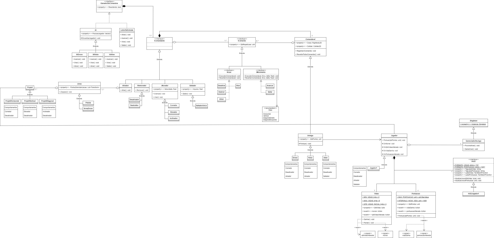

# Runnengun
### Descrição
Runnengun é um jogo 2D de plataforma, no qual o jogador tem a capacidade de reverter o último segundo do jogo.
### Propósito
Desenvolvi este projeto para pôr em prática os padrões de design e os princípios SOLID que aprendi no curso [Design Patterns](https://www.coursera.org/learn/design-patterns). Ele foi projetado para ter a modularidade como principal característica.
### Design

Cada elemento do jogo tem funcionalidades atribuídas a ele dinamicamente. Elas são testadas individualmente, assegurando que elas funcionem em todos os elementos que supram os seus requisitos.

A capacidade de reverter o tempo foi projetada usando o padrão _Command_, no qual todos os comandos registrados no último segundo podem ser revertidos quando o jogador pressiona um botão. Porém, nem todos os comandos podem ser registrados, ficando isso a critério de cada elemento do jogo.

A interface que aparece durante o jogo é mantida atualizada usando o padrão _MVP_ ou _Model View Presenter_, uma variação do padrão _MVC_. As vidas e a pontuação sinalizam toda vez que são alterados, o jogador recebe os sinais e envia mensagens que atualizam a interface de usuário.
